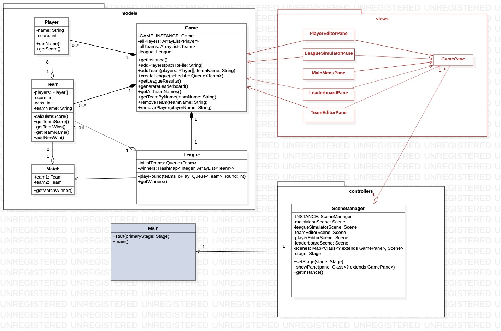
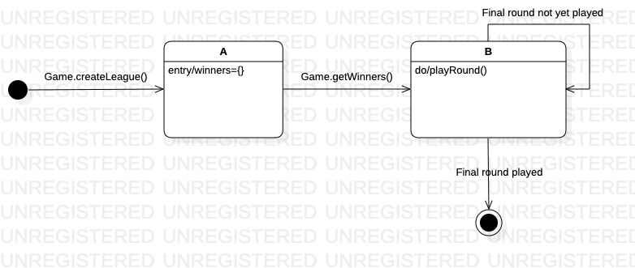

# Assignment 2

Maximum number of words for this document: 12000

**IMPORTANT**: In this assignment you will model the whole system. Within each of your models, you will have a *prescriptive intent* when representing the elements related to the feature you are implementing in this assignment, whereas the rest of the elements are used with a *descriptive intent*. In all your diagrams it is strongly suggested to used different colors for the prescriptive and descriptive parts of your models (this helps you in better reasoning on the level of detail needed in each part of the models and the instructors in knowing how to assess your models).   

**Format**: establish formatting conventions when describing your models in this document. For example, you style the name of each class in bold, whereas the attributes, operations, and associations as underlined text, objects are in italic, etc.

### Implemented feature

| ID  | Short name  | Description  |
|---|---|---|
| F6  | League Formation | Allow the user to set up a league with its own schedule. The first round can have at most 16 matches. Matches will be played according to this schedule and the system will output the winner of each individual game. |

This is the only feature we implemented; a league has (for now) a fixed-size of 16 teams in the first round. Players and teams are hard-coded into the system.

### Used modeling tool
Add here the name of the modeling tool you are using for your project.

In this document you have to adhere to the following formatting conventions:
- the name of each **class** is in bold
- the *attributes*, *operations*, *associations*, and *objects* are in italic.

## Class diagram									
Author(s): `Teona Moga`

The system we designed for the Fantasy Soccer project consists of 3 packages: *models*, *views* and *controllers* and one Main class. Packages *views* and *controllers* deal with the GUI part of the project and are implemented using the javafx library, such that they will be described more briefly than *models*, which is where the entire back-end logic lies.   
  
### *Models* package  
  
This package implements 5 distinct classes: **Game**, **League**, **Team**, **Player** and **Match**, described below.  
  
#### **Game**  
  
This class is responsible with managing the data of the game and coordinating actions across the system. As can be observed from the diagram, it follows the singleton design pattern; this decision was made in the attempt to keep the data consistent and the instance of the class easily accessible, as it is regularly used by the GUI.  
  
Attributes 
  
- *allPlayers* (type: ArrayList<Player&gt;): list of all user-added players  
- *allTeams* (type: ArrayList<Team&gt;): list of all user-created teams  
- *league* (type: League): user-created league  
  
Operations
  
- *void addPlayers(String pathToFile)* : method for adding new players to the *allPlayers* arraylist; parameter specifies the path to the CSV file, as per **FR1**  
  
- *void addTeam(Player[] players, String teamName)*: method for adding a team to the *allTeams* arraylist; parameters are the same as the ones required by the **Team** constructor.  
  
- *void createLeague(Queue<Team&gt; schedule)*: method for defining the league to be played; parameter is a list of teams ordered by their playing order, e.g.  a round with matches (Team1 vs. Team2) and (Team3 vs. Team4) would be represented as {Team1, Team2, Team3, Team4}.
- *HashMap<Integer, ArrayList<Team&gt;> getLeagueResults()*: returns the winners of *league* in the original format of the **League** class (described below)
- *ArrayList<Team&gt; generateLeaderboard()*: returns a sublist of first 10 teams in *allTeams*  sorted by their number of wins (**Team**.wins)
- *ArrayList<String&gt; getAllTeamNames()*: returns the team names of teams in *allTeams*
- *Team getTeamByName(String name)*: returns the team from *allTeams* with the given *name*
- *void removeTeam(String teamName)*: removes the team with the given *teamName* from *allTeams*
- *void removePlayer(String playerName)*: removes the player with the given *playerName* from *allPlayers*

Associations

As can be observered from the class diagram, the **Game** class has composition relations with **Team**, **Player** and **League**, as it is resposible with creating and storing these other objects. While it can store an indefinite number of teams and players, a game can only have one league, as a user can not play multiple leagues at one time.  It also has associations with the GUI classes, which intercat with **Game** to either follow up on user actions, e.g. forming a new team, or get the data to be displayed to the user, e.g. the leaderboard.

#### **Player**

Class representing a single player. Only exists within a **Game** and is created from user input.

Attributes 

- *name* (type: String): player's name
- *score* (type: int): player's score

Operations

- *String getName()*: returns *name*
- *int getScore()* : returns *score*

Associations

All **Player** objects are contained within **Game**. A team is an aggregation of exactly 8 **Player** objects. 

#### **Team**

Class representing a single soccer team. Only exists within a **Game** and is created through the GUI by the user through the selection of 8 **Player** objects.

Attributes 

- *players* (type: Player[]): all the players in a team. Represented by an array as a team has exactly 8 players.
- *score* (type: int): team's total score
- *wins* (type: int): team's total number of wins in leagues played by the user; initilized to 0
- *teamName* (type: String): team name, unique attribute used to identify a team

Operations 

- *int calculateScore()*: calculates the *score* of a team by adding up all the *players* objects individual scores
-  *int getTeamScore()*: returns *score*
-  *int getTotalWins()*: returns *wins*
- *String getTeamName()*: returns *teamName*
- *void addNewWin()*: increments *wins*

Associations

The composition relation between **Team** and **Game** suggests the fact that all **Team** objects ever created are part of the **Game**.allTeams. 
Each team is an aggregation of exactly 8 **Player** objects.  

#### **League** 

A league simulates multiple rounds of matches between user-selected teams and determines the winners.

Attributes

- *initialTeams* (type:Queue<Team&gt;): List of the teams playing in the first round, as selected by the user.  Already described in **Game**.createLeague's parameter as: list of teams ordered by their playing order, e.g.  a round with matches (Team1 vs. Team2) and (Team3 vs. Team4) would be represented as {Team1, Team2, Team3, Team4}
-  *winners* (type: HashMap<Integer, ArrayList<Team&gt;>):  A key represents the round number, e.g. first round is 1, while the values represent the winners at each given round.

Operations

- *void playRound(Queue<Team&gt; teamsToPlay, int round)*: recursive method that generates *winners*. First call is *playRound(initialTeams, 1)*. The method calls itself for following rounds until one team remains (the league winner) 
- HashMap<Integer, ArrayList<Team>> getWinners(): calls *playRound* method and returns *winners*

Associations

A single **League** object can exist at one time within a **Game**. A league can start with at most 16 teams as per requirement **FR6**. Within the *playRound* method, **Match** objects are created from the playing teams to generate a winner.

#### **Match**

A match simulates a single soccer game between two teams.

Attributes

* *team1* (Type: Team): first team in the match
* *team2* (Type: Team): second team in the match

Operations

- *Team getWinner()*: returns the winner of a match as described in **FR8** and **FR9**

Assiciations

A match is formed of exactly 2 **Team** objects.

### *Views* package

Each class in this package is an extention of the **GamePane** abstract class, described below. Each uses the *javafx* library and represents a different window in the GUI. All interactions with the *models* package are made via the **Game** class methods.

#### **GamePane**

Abstract methods

- *void connectComponents()*: Connects all components into the root of a *javafx.scene.Scene*
- *void styleComponents()*: Styles all components as required
- *void setCallbacks()*: Sets callbacks for all interactive components

### *Controllers* package

Only consists of a singleton class **SceneManager** used for managing the *javafx* Scenes.

Operations

- *void setStage(final Stage stage)*: Sets the primary stage
- *void showScene(final Scene scene)*: Replaces the currently active Scene with another one
- *void showPane(final Class<? extends GamePane> pane)*: Replaces the current  **GamePane** with another
- *SceneManager getInstance()*: returns the instance of the calss

## Object diagrams								
Author(s): `name of the team member(s) responsible for this section`

This chapter contains the description of a "snapshot" of the status of your system during its execution. 
This chapter is composed of a UML object diagram of your system, together with a textual description of its key elements.

`Figure representing the UML class diagram`
  
`Textual description`

Maximum number of words for this section: 1000

## State machine diagrams									
Author(s): `name of the team member(s) responsible for this section`

This chapter contains the specification of at least 2 UML state machines of your system, together with a textual description of all their elements. Also, remember that classes the describe only data structures (e.g., Coordinate, Position) do not need to have an associated state machine since they can be seen as simple "data containers" without behaviour (they have only stateless objects).

For each state machine you have to provide:
- the name of the class for which you are representing the internal behavior;
- a figure representing the part of state machine;
- a textual description of all its states, transitions, activities, etc. in a narrative manner (you do not need to structure your description into tables in this case). We expect 3-4 lines of text for describing trivial or very simple state machines (e.g., those with one to three states), whereas you will provide longer descriptions (e.g., ~500 words) when describing more complex state machines.

The goal of your state machine diagrams is both descriptive and prescriptive, so put the needed level of detail here, finding the right trade-off between understandability of the models and their precision.

Maximum number of words for this section: 3000

--NEW

In the way our system is designed, only the **Game** and **League** classes are not stateless. Their state diagrams are shown below.

The state diagram above represents the different states a league can be in. When it is initialized, no rounds are played so the *winners* map is empty. **League** has one recursive method, called when the results of the created schedule, i.e. **initialTeams**, are requested. What breaks the recursion is having no more matches to play in a subsequent round, as there is only one team left (the winner of the league).

## Sequence diagrams									
Author(s): `name of the team member(s) responsible for this section`

This chapter contains the specification of at least 2 UML sequence diagrams of your system, together with a textual description of all its elements. Here you have to focus on specific situations you want to describe. For example, you can describe the interaction of player when performing a key part of the videogame, during a typical execution scenario, in a special case that may happen (e.g., an error situation), when finalizing a fantasy soccer game, etc.

For each sequence diagram you have to provide:
- a title representing the specific situation you want to describe;
- a figure representing the sequence diagram;
- a textual description of all its elements in a narrative manner (you do not need to structure your description into tables in this case). We expect a detailed description of all the interaction partners, their exchanged messages, and the fragments of interaction where they are involved. For each sequence diagram we expect a description of about 300-500 words.

The goal of your sequence diagrams is both descriptive and prescriptive, so put the needed level of detail here, finding the right trade-off between understandability of the models and their precision.

Maximum number of words for this section: 3000

## Implementation									
Author(s): `name of the team member(s) responsible for this section`

In this chapter you will describe the following aspects of your project:
- the strategy that you followed when moving from the UML models to the implementation code;
- the key solutions that you applied when implementing your system (for example, how you implemented the syntax highlighting feature of your code snippet manager, how you manage fantasy soccer matches, etc.);
- the location of the main Java class needed for executing your system in your source code;
- the location of the Jar file for directly executing your system;
- the 30-seconds video showing the execution of your system (you can embed the video directly in your md file on GitHub).

IMPORTANT: remember that your implementation must be consistent with your UML models. Also, your implementation must run without the need from any other external software or tool. Failing to meet this requirement means 0 points for the implementation part of your project.

Maximum number of words for this section: 2000

## References

References, if needed.
