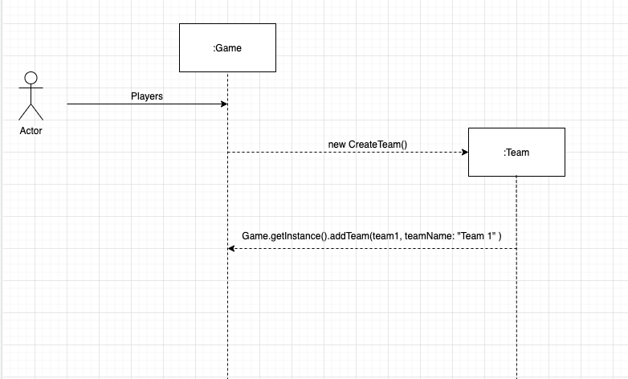
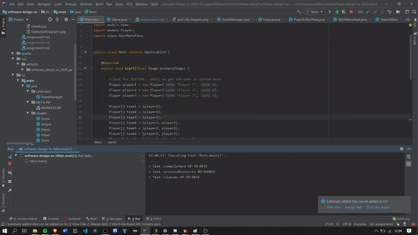

# Assignment 2

### Implemented feature

| ID  | Short name  | Description  |
|---|---|---|
| F6  | League Formation | Allow the user to set up a league with its own schedule. The first round can have at most 16 matches. Matches will be played according to this schedule and the system will output the winner of each individual game. |

This is the only feature we implemented; a league has (for now) a fixed-size of 16 teams in the first round. Players and teams are hard-coded into the system.

### Used modeling tool
[StarUML](http://staruml.io/) 

## Class diagram									
Author(s): `Teona Moga`

The system we designed for the Fantasy Soccer project consists of 3 packages: *models*, *views* and *controllers* and one Main class. Packages *views* and *controllers* deal with the GUI part of the project and are implemented using the javafx library, such that they will be described more briefly than *models*, which is where the entire back-end logic lies.   
  
### *Models* package  
  
This package implements 5 distinct classes: **Game**, **League**, **Team**, **Player** and **Match**, described below.  
  
#### **Game**  
  
This class is responsible with managing the data of the game and coordinating actions across the system.
  
Attributes 
  
- *allPlayers* (type: ArrayList<Player&gt;): list of all user-added players  
- *allTeams* (type: ArrayList<Team&gt;): list of all user-created teams  
- *league* (type: League): user-created league  
  
Operations
  
- *void addPlayers(String pathToFile)* : method for adding new players to the *allPlayers* arraylist; parameter specifies the path to the CSV file, as per **FR1**  
  
- *void addTeam(Player[] players, String teamName)*: method for adding a team to the *allTeams* arraylist; parameters are the same as the ones required by the **Team** constructor.  
  
- *void createLeague(Queue<Team&gt; schedule)*: method for defining the league to be played; parameter is a list of teams ordered by their playing order, e.g.  a round with matches (Team1 vs. Team2) and (Team3 vs. Team4) would be represented as {Team1, Team2, Team3, Team4}.
- *HashMap<Integer, ArrayList<Team&gt;> getLeagueResults()*: returns the winners of *league* in the original format of the **League** class (described below)
- *ArrayList<Team&gt; generateLeaderboard()*: returns a sublist of first 10 teams in *allTeams*  sorted by their number of wins (**Team**.wins)
- *ArrayList<String&gt; getAllTeamNames()*: returns the team names of teams in *allTeams*
- *Team getTeamByName(String name)*: returns the team from *allTeams* with the given *name*
- *void removeTeam(String teamName)*: removes the team with the given *teamName* from *allTeams*
- *void removePlayer(String playerName)*: removes the player with the given *playerName* from *allPlayers*

Associations

As can be observered from the class diagram, the **Game** class has composition relations with **Team**, **Player** and **League**, as it is resposible with creating and storing these other objects. While it can store an indefinite number of teams and players, a game can only have one league, as a user can not play multiple leagues at one time.  It also has associations with the GUI classes, which intercat with **Game** to either follow up on user actions, e.g. forming a new team, or get the data to be displayed to the user, e.g. the leaderboard.

#### **Player**

Class representing a single player. Only exists within a **Game** and is created from user input.

Attributes 

- *name* (type: String): player's name
- *score* (type: int): player's score

Operations

- *String getName()*: returns *name*
- *int getScore()* : returns *score*

Associations

All **Player** objects are contained within **Game**. A team is an aggregation of exactly 8 **Player** objects. 

#### **Team**

Class representing a single soccer team. Only exists within a **Game** and is created through the GUI by the user through the selection of 8 **Player** objects.

Attributes 

- *players* (type: Player[]): all the players in a team. Represented by an array as a team has exactly 8 players.
- *score* (type: int): team's total score
- *wins* (type: int): team's total number of wins in leagues played by the user; initilized to 0
- *teamName* (type: String): team name, unique attribute used to identify a team

Operations 

- *int calculateScore()*: calculates the *score* of a team by adding up all the *players* objects individual scores
-  *int getTeamScore()*: returns *score*
-  *int getTotalWins()*: returns *wins*
- *String getTeamName()*: returns *teamName*
- *void addNewWin()*: increments *wins*

Associations

The composition relation between **Team** and **Game** suggests the fact that all **Team** objects ever created are part of the **Game**.allTeams. 
Each team is an aggregation of exactly 8 **Player** objects.  

#### **League** 

A league simulates multiple rounds of matches between user-selected teams and determines the winners.

Attributes

- *initialTeams* (type:Queue<Team&gt;): List of the teams playing in the first round, as selected by the user.  Already described in **Game**.createLeague's parameter as: list of teams ordered by their playing order, e.g.  a round with matches (Team1 vs. Team2) and (Team3 vs. Team4) would be represented as {Team1, Team2, Team3, Team4}
-  *winners* (type: HashMap<Integer, ArrayList<Team&gt;>):  A key represents the round number, e.g. first round is 1, while the values represent the winners at each given round.

Operations

- *void playRound(Queue<Team&gt; teamsToPlay, int round)*: recursive method that generates *winners*. First call is *playRound(initialTeams, 1)*. The method calls itself for following rounds until one team remains (the league winner) 
- HashMap<Integer, ArrayList<Team>> getWinners(): calls *playRound* method and returns *winners*

Associations

A single **League** object can exist at one time within a **Game**. A league can start with at most 16 teams as per requirement **FR6**. Within the *playRound* method, **Match** objects are created from the playing teams to generate a winner.

#### **Match**

A match simulates a single soccer game between two teams.

Attributes

* *team1* (Type: Team): first team in the match
* *team2* (Type: Team): second team in the match

Operations

- *Team getWinner()*: returns the winner of a match as described in **FR8** and **FR9**

Assiciations

A match is formed of exactly 2 **Team** objects.

### *Views* package

Each class in this package is an extention of the **GamePane** abstract class, described below. Each uses the *javafx* library and represents a different window in the GUI. All interactions with the *models* package are made via the **Game** class methods.

#### **GamePane**

Abstract methods

- *void connectComponents()*: Connects all components into the root of a *javafx.scene.Scene*
- *void styleComponents()*: Styles all components as required
- *void setCallbacks()*: Sets callbacks for all interactive components

### *Controllers* package

Only consists of class **SceneManager** used for managing the *javafx* Scenes.

Operations

- *void setStage(final Stage stage)*: Sets the primary stage
- *void showScene(final Scene scene)*: Replaces the currently active Scene with another one
- *void showPane(final Class<? extends GamePane> pane)*: Replaces the current  **GamePane** with another
- *SceneManager getInstance()*: returns the instance of the class

## Object diagrams								
Author(s): `Torstein Thomassen`

TODO

This object diagram shows an example of objects with different states in our program.
All the different attributes and variables has to be fulled in with example data.

In this example each team has only three players. This is only for demonstration and will be fixed for the final version.

This structure resembles very a tree structure with branches and leafs. The tree structure is commonly used in many software design. It's an efficient and good way to structure the relation between objects. 

This creates a hieracy where a parent can only directly affect the children. E.g the *Match* can't affect the *Player* directly, only the *Team*s       

`Object diagram over the Match Class`

The diagram above shows an example over the *Match* class. It has a relation with two *Team* object, and the *Team* object again has a relation with various *Player* object
As you can see *Team 1* would win the match because they have a higher score.  

Maximum number of words for this section: 1000

## State machine diagrams									
Author(s): `Torstein Thomassen` & `Teona Moga`

In the way our system is designed, only the **Game** and **League** classes are not stateless. Their state diagrams are shown below.

`State diagram over League Class`

The state diagram above represents the different states a league can be in. When it is initialized, no rounds are played so the *winners* map is empty. **League** has one recursive method, called when the results of the created schedule, i.e. **initialTeams**, are requested. What breaks the recursion is having no more matches to play in a subsequent round, as there is only one team left (the winner of the league).

`State diagram over Game Class`

TODO // talk about this thing 

## Sequence diagrams									
Author(s): `Patricia Santana Vasquez`

**Title: Team Creation**

**Elements**

The main goal and focus of this sequence diagram was to show the interaction between the user and the interaction partners/ objects of :game and :team within our fantasy soccer single player game. The sequence diagram above shows how a user can input data to create a team in the game. This part of the system will be executed once the player data is within our game and provided by the user. The user is represented by a stick figure within the sequence diagram with the title “Actor”. The user provided data of players is sent to the interaction partner and object of :game. The :game object is represented as a head of a lifeline. From the game object, the send event of new CreateTeam() is executed and the object of a new team is created. Because this is an example of a creation of a new object within our software system, the Arrowhead is pointing to the head of the :team object and is dashed. This send event points to the interaction partner and object of :team which then executes Game.getInstance().addTeam() once that message is received. This a representation of a receive event within this sequence diagram.Once this receive event is executed, the software system we created will add a team to the game. In the end, this a simple part of the software system but a vital one to the creation of our fantasy soccer game. Without the creation of a team/teams with the use of player data provided by the user/Actor the basic functionality of the game would not be possible. This sequence diagram is representative of the way in which we have focused on implementing a simple and feasible fantasy soccer game.

## Implementation									
Author(s): `name of the team member(s) responsible for this section`

The first step in our implementation process was coming up with very basic UML diagrams that outlined the basic classes and functionality required by the system. We followed an Agile approach, where we would go back and forth between our code and the diagrams, until we achieved the desired functionality (the implementation of feature FR6). We also focused on implementing the GUI such that we would be able to integrate it with the back-end and have the league formation feature work not only at a code level but also at a user level. 

Location of the main Java class required for executing the system is: `software-design-vu/src/main/java/Main.java`

Running the main class should result in opening the application as shown below:

This video shows the execution of the program where we have implemented feature F6. The user can setup a league with different teams and it displays the winner of each game as an output.
 
We didn't manage to create a JAR although closely following the instructions in both git and the external website provided. 

## References

References, if needed.
